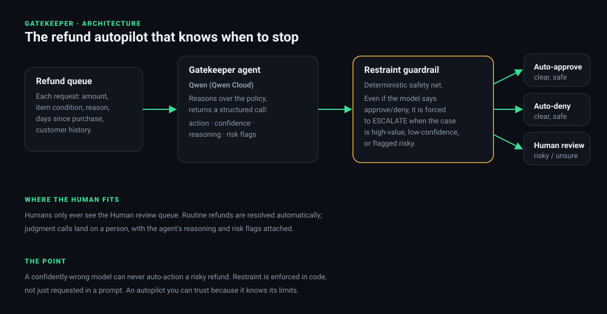
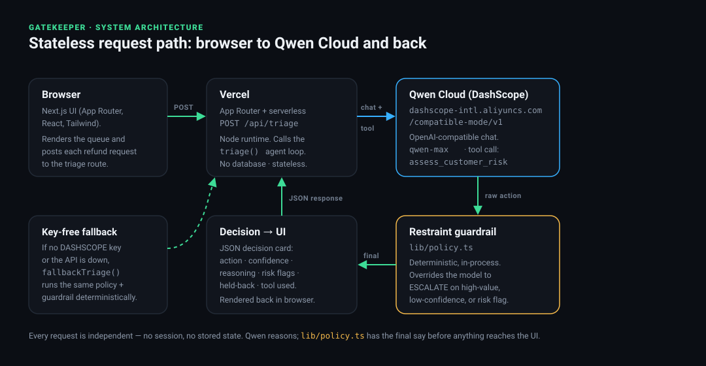

# Gatekeeper: the refund autopilot that knows when to stop

> **Global AI Hackathon Series with Qwen Cloud · Track: Autopilot Agent · built solo with Claude Code.**

Refund and dispute triage is the kind of high-volume, judgment-heavy work teams want to automate. The catch: an agent that auto-approves and auto-denies everything will, sooner or later, confidently refund a fraudster or reject a legitimate customer. The dangerous failure is not slowness, it is an autopilot that acts when it should have stopped.

**Gatekeeper is an autonomous refund-triage agent built on Qwen that clears the routine cases on its own and refuses to act on the risky ones**, escalating them to a human with its reasoning and risk flags attached.



*Decision logic: how a single request flows from the queue, through the Qwen call, into the restraint guardrail, and out to one of three outcomes.*



*System architecture: where the code actually runs. The browser (Next.js UI) posts to a Vercel App Router route (`/api/triage`), which calls the Qwen Cloud DashScope endpoint (`qwen-max` + the `assess_customer_risk` tool call), applies the `lib/policy.ts` guardrail in-process, and returns the decision. No database — every request is stateless.*

## What it does

Give it a queue of refund requests (amount, item condition, stated reason, days since purchase, customer history). For each one:

- **Clear and safe** (defective item in window, unopened return, obvious policy match): Gatekeeper **auto-approves or auto-denies** it.
- **Risky or uncertain** (high-value, possible serial refunder, stated reason conflicts with the item, ambiguous policy, low confidence): it **refuses to act** and **escalates to a human**, with the reasoning and the flags that triggered the hold.

A human only ever sees the escalation queue. Everything else is resolved automatically.

## The differentiator: restraint enforced in code, not just asked for in a prompt

The triage call comes from Qwen, but the **restraint guardrail** (`lib/policy.ts` + `lib/agent.ts`) is deterministic and sits on top of the model. Even if the model confidently returns `approve` on the $1,240 TV or a customer with four refunds this month, the guardrail overrides it to `escalate` when any of these hold:

- self-reported **confidence < 0.78** → escalate
- **amount > $500** (high-value) → escalate
- any **blocking risk flag** (`serial-refunder`, `suspected-fraud`, `conflicting-evidence`, `policy-ambiguous`, `chargeback-risk`) → escalate

The guardrail is a **one-way ratchet**: it can only ever make a decision *safer* (push it to `escalate`), never less safe — it cannot turn an escalate into an auto-action. So a confidently-wrong model can never auto-action a risky refund. The UI shows exactly when this fires: *"the model proposed approve, Gatekeeper held back and escalated instead."* That is the whole idea. An autopilot you can trust because it knows its limits.

## Sophisticated Qwen use: a real tool call, not free-text guessing

Gatekeeper's Qwen integration is built around a genuine **function/tool call**, `assess_customer_risk` (defined and forced in [`lib/agent.ts`](lib/agent.ts)). The triage loop is two Qwen turns: on the first turn `tool_choice` **requires** the model to call `assess_customer_risk` before it is allowed to decide; on the second turn, with the tool result in context, Qwen returns the structured decision JSON.

The tool fetches three deterministic risk signals from the trusted request fields:

- **prior refund count** and whether the customer is a **serial refunder** (3+ refunds in the recent window),
- whether the **stated reason conflicts with the item's actual condition** (e.g. "never opened" on a visibly used item).

**Why a tool call instead of letting the model read them off the free text?** Because those signals are exactly the ones a confidently-wrong model gets wrong. Parsing "4 refunds in the last 30 days" into `serialRefunder: true`, or catching a reason-vs-condition contradiction, is a deterministic computation — not a judgment call — so we compute it in code and hand Qwen the ground truth. Critically, the tool result is derived from the **trusted request fields, not the model-supplied arguments**: a model that could freely populate its own tool inputs could poison its own risk signal, so the model gets a lookup it cannot fabricate. The decision card in the UI shows which tool was called on every decision.

This is a deliberately different axis of Qwen sophistication from a multi-agent / MCP architecture. Gatekeeper is a **single tool-calling agent** doing real-time triage — one agent, one enforced function call, one deterministic guardrail — rather than several agents coordinating over a protocol.

## How it's built

- **Qwen (`qwen-max`) on Qwen Cloud** is the reasoning engine, called through the OpenAI-compatible Alibaba Cloud DashScope endpoint (`https://dashscope-intl.aliyuncs.com/compatible-mode/v1`) with `temperature: 0` and structured JSON output. Proof of Qwen Cloud deployment: [`lib/qwen.ts`](lib/qwen.ts) + the live call in [`lib/agent.ts`](lib/agent.ts).
- **Tool-calling:** the agent invokes a real Qwen **function call**, `assess_customer_risk`, to fetch deterministic risk signals (prior refunds, serial-refunder status, reason-vs-condition conflict) instead of guessing them from free text. The decision card shows which tool was called.
- **The restraint guardrail** (`lib/policy.ts` + `applyRestraint` in `lib/agent.ts`) is the deterministic safety net that guarantees escalation on risky cases.
- **Next.js (App Router) + TypeScript + Tailwind** for the dashboard and the `/api/triage` route.
- A **key-free deterministic fallback** keeps the app running before the Qwen credits land and if the API is ever unavailable, so the demo never crashes.

This is a **coded agent** (an explicit generate → tool-call → decide loop in TypeScript) rather than a low-code agent.

## Tests & aggregate evidence

The safety property is unit-tested: **26 Vitest tests** (`npm test`) pin the guardrail invariants — high-value, low-confidence, and blocking flags all force escalation; a clean case passes through; and an `escalate` is never downgraded to an auto-action — plus end-to-end checks over the demo queue. See [`tests/restraint.test.ts`](tests/restraint.test.ts).

Beyond the one $1,240 anecdote, [`public/benchmark.json`](public/benchmark.json) (regenerate with `npx tsx scripts/aggregate.ts`) is a committed aggregate over the whole queue: **8 cases → 5 auto-resolved and 3 escalated to a human; each of the 3 escalations was a model auto-action the guardrail held back.** It quantifies how much routine work is cleared and how often restraint fires.

## Run it locally

```bash
npm install
cp .env.example .env     # add your Qwen Cloud (DASHSCOPE) API key
npm run dev              # http://localhost:3000
```

Click **Run Gatekeeper on the queue**. With a valid key it uses live Qwen; without one it runs the deterministic fallback so you can still see the full flow. Pick your model in `.env` (`QWEN_MODEL`, e.g. `qwen-max`). A **live / fallback badge** in the top corner tells you at a glance which path a decision took: green *"LIVE: Qwen Cloud"* after a real API call, amber *"FALLBACK MODE"* after the deterministic path.

**Try your own request.** Below the queue is an interactive panel — type any refund scenario (amount, days since purchase, item condition, stated reason, customer history) and send it straight through the live Qwen agent. Push a high-value order or a serial refunder and watch the guardrail hold the model back in real time. It is not a canned demo.

## What's next

- **Out of scope by design:** wiring a side-effecting write integration to a real commerce or ticketing backend (Shopify, Zendesk) to *execute* the approvals. Gatekeeper's contribution is the trustworthy decision; acting on it is a deliberate next step, not a missing piece.
- Learn the escalation thresholds from human overrides over time.
- Add a second judgment category for disputes and chargebacks.

Built solo with **Claude Code**.
